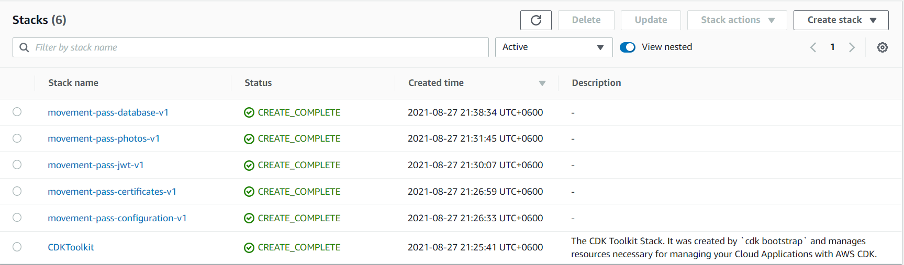

# Foundation

## Setup

When starting a new solution there are always some foundational work that we have to. Since we are hosting the solution
in AWS, it is always recommended to create a new AWS Organization to host the solution. In this case I have created a
new AWS Organization named `movement-pass` and an IAM user `dev@movement-pass` with administrative privileges with only
programmatic access. Next, we need a domain to host the solution, so I registered a new domain `movement-pass.com` in
Route53, when registration the new domain from the AWS console, it automatically creates the Hosted Zone for us, if you
are transferring domain you have to create the hosted zone manually. Please note that creating new AWS organization, IAM
user or registering domain are all optional things in this case, but these are so common things that you have to do when
starting a new solution I prefer to mention those, also note that apart from the above manual steps rest of the part are
fully automated. The next important decision that we have to make is in which AWS region we are going to deploy our
solution, since our application would be used by our local users, the nearest region seems to be the
Mumbai(`ap-south-1`), Singapore(`ap-southeast-1`) and Hong Kong(`ap-east-1`), I find `ap-south-1` a bit more responsive
comparing others when accessed from our country, so `ap-south-1` would be our primary region.

## Infrastructure as Code (IaC)

When creating resource, we can obviously use UI or CLI, but the problem with that approach is that it is not reputable,
fully error-prone, non-transactional and let alone the change tracking. To address those issues it is recommended to use
an IaC tool, AWS CloudFormation is tha native IaC for AWS, another popular tool is Terraform of HashiCorp. But in this
solution we are going to use Cloud Development Kit(CDK) of AWS which generates CloudFormation templates from your
favorite language (JavaScript, TypeScript, C#, Python, Java) - being a developer I prefer my language instead of
wrangling with JSON or YML files (although CDK is used, but I highly recommend to become familiar with CloudFormation
because that is what your stack definition really is). Do make sure you have cdk installed globally:

```shell
npm install -g aws-cdk
```

Yes, it is required regardless the language you use in CDK.

## ParameterStore

When working with multi distribution unit we often have to share the same configuration values across the deployment
units. AWS ParameterStore of the Systems Manager is the perfect candidate to store and share configuration values across
the deployment units. The path or values of the configuration may differ based on .NET or Node.js stack but the purpose
is the same.

## Stacks

There are two separate repository for each implementation:

* [node-foundation](https://github.com/movement-pass/node-foundation)
* [dotnet-foundation](https://github.com/movement-pass/dotnet-foundation)

And each contains the following stacks:

### Configuration

It stores the solution name version and domain name in the ParameterStore, the name and version is used as prefix and
suffix in different places for namespacing.

### Certificates

We need SSL certificates to associate with our domain, our public facing application would be available
on <https://movement-pass.com> and the REST API that the public facing application would access would be
on <https://public-api.movement-pass.com>. Since our UI applications would be distributed through AWS CloudFront, we
need the certificate to be also available in `us-east-1` region. This stacks creates the certificates, does the dns
validation and puts the certificates ARN in ParameterStore so other stack can refer it. Other than these, this stack
also creates two Lambdas which does the certificate validation, do not worry about those lambdas, these are
automatically created by cdk and would be invoked only once when it does the dns validation.

### Jwt

We are going to use jwt based authorization in our public facing application, this stack adds the jwt related
configuration in the ParameterStore. Those who knows AWS Cognito may wonder why we are using our own user management
instead of Cognito, well the reason to use our own implementation is that at the time of writing there is no way to
replicate Cognito users across different AWS regions, though it is possible to access AWS Congnito of one region from
another region, but if the source region is down, then the other region deployed unit which depends on it would be down
too. But we do have plan to make our solution highly available with multi-region deployment, that is the reason we are
going to store the user information in DynamoDB global table which automatically get replicated across regions. Another
important thing to note that for the time being I am using symmetric key for the jwt, but prior production we defiantly
have to change it to RSA based keys.

**Note**: AWS Cognito would be used in management dashboard. If you are building single region solution, I highly
recommend it instead of your own.

### Photos

In our public facing application we need support to store the photos of users which they upload in the registration,
this stack creates the S3 bucket to store the photos, it also associates a CloudFront distribution with
domain `photos.movement-pass.com`. Please note that since photos will be severed through CloudFront the public access of
the S3 bucket is completely disabled.

### Database

This stack responsible for creating two DynamoDB tables, which would be our primary source of data throughout our
solution. When creating the tables one thing you would notice that we have enabled streaming of the tables which we are
going to discuss in details when we implement the analytics part.

Once, you complete running the stacks you would find the following stacks in CloudFormation console:


