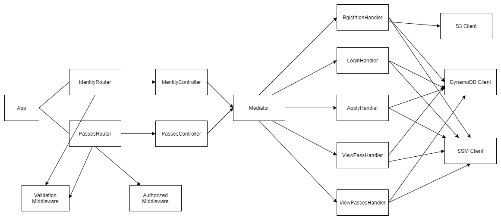

# Public API

Public API is REST API that is consumed by the public facing application. You can find the Open Api specification over
here <https://public-api.movement-pass.com/v1/index.html>. The `identity` endpoint is responsible for user
registration/login and the `passes` endpoint which can be only accessed by authenticated users for applying and viewing
the pass/passes. As mentioned previously we have both NodeJS and .NET implementation but the input/output of the API are
identical.

## NodeJS

The NodeJS implementation is an Express.js application written in typescript. Most of the common construct of express is
used but the implementation is not typical that you usually see in regular express application. The patterns and
principles that are used here are originated from the .NET community, I find nothing wrong even do recommend bringing
the principles and practises from other communities which helps you to build better software. Let's see the high level
diagram of this express application:

The app contains two routers which itself tied with middlewares, when a request arrives the middleware ensures whether
it can continue processing the request(request validation, authorization) or to early return, if the middleware allows,
the router delegates the request processing to its associate controller method. When the controller is called, based on
the method it instantiates a request class from the incoming http request and sends it to mediator for handling. Based
on the request the mediator knows which handler is responsible for handling the request and delegates the request to
that handler, when the handler returns it result the mediator returns the result back to the calling controller. When
the controller receives the result from the mediator, depending upon it constructs the http response and returns 
to client.
